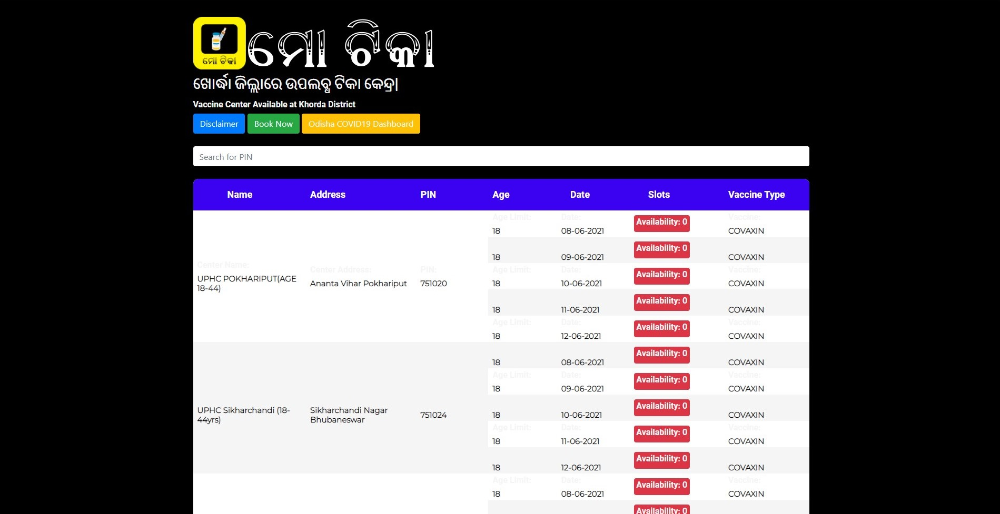
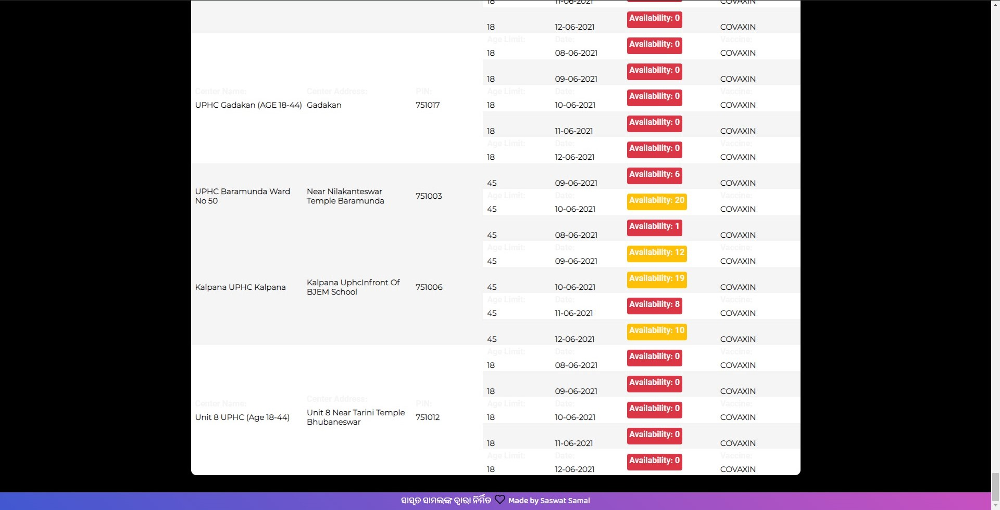
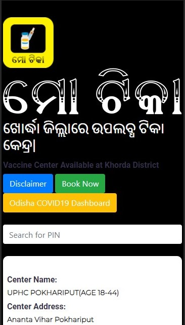
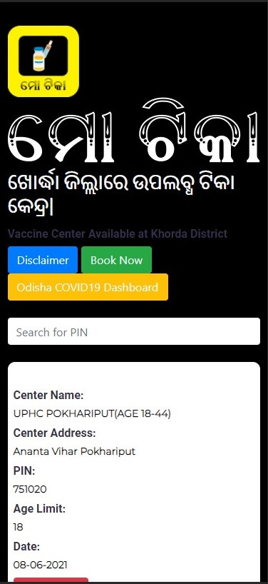
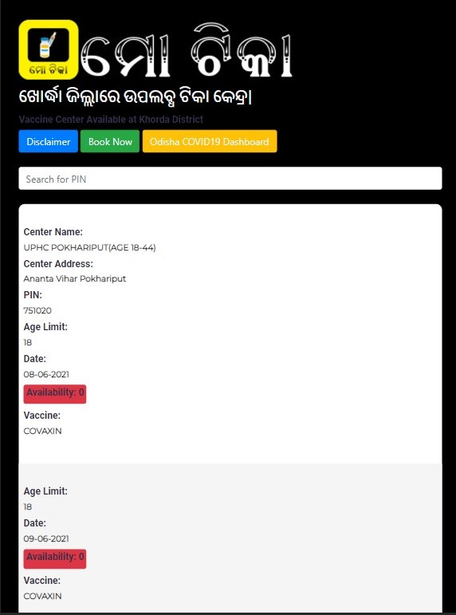

<a href="https://mo-tika.netlify.app/">

 
<h1 align="center"> Mo Tika 💉</h1>

 MoTika is a portal for the district of Khurda, Odisha to get the information about the availability of COVID-19 Vaccine.

<h1></h1>

## About Mo Tika 💉😷
#### Mo Tika is a website specially meant for Khurda District of Odisha State to Track the availabilty of COVID-19 Vaccine.

I usually used to face difficulty to find the vaccine status near me and therefore meant this only for my district. It uses the Open API provided by CoWin to get the status of vaccines. All the data are fetched from the API itself, the website only renders the content.

## Screenshots 🖼
#### Desktop View 💻
Desktop View 1 | Desktop View 2
------------ | -------------
 | 

#### Other Device View 📱 
Moto G4 | iPhone X | iPad
------------ | ------------- | -------------
 |  |  |

## Features 🚀
1. Real Time Update (from the CoWin API). 📈
2. Attractive UI. 🌈
3. Tabular Form Data. 📑

## Required Improvements ✅➕
1. Search Bar. 🔎
2. Google Map Link for Vaccine Centers. 💉
3. Automatically Date Picker from IST. 📅

## Bug 🐜
1. Dates are changed manually. 📅

## Built with

## References 🌐

1. [Cowin API](https://apisetu.gov.in/public/marketplace/api/cowin): for API
2. [Colorlib](https://colorlib.com/): for Table Theme
